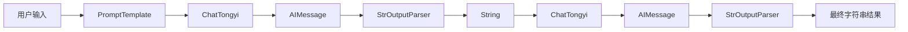

# LangChain 学习笔记：StrOutputParser 使用详解

## 一、学习目标

- 理解 StrOutputParser 的作用
- 掌握 AIMessage 与字符串的转换过程
- 学习 Prompt → LLM → Parser 工作流
- 理解 LCEL 中输出解析器的位置
- 掌握链式调用中的数据流转

---

## 二、案例源码

```python
from langchain_core.output_parsers import StrOutputParser
from langchain_core.prompts import PromptTemplate
from langchain_community.chat_models.tongyi import ChatTongyi

parser = StrOutputParser()

model = ChatTongyi(
    model="qwen-plus"
)

prompt = PromptTemplate.from_template(
    "姓氏{lastname}，性别{gender}，直接给出合适名字，只输出名字，不要多余话语、不要提问。"
)

chain = prompt | model | parser | model | parser

res = chain.invoke(
    input={
        "lastname":"张",
        "gender":"女"
    }
)

print(res)
```

---

## 三、整体执行流程



---

## 四、StrOutputParser 简介

StrOutputParser 是 LangChain 中最常用的输出解析器。

作用：

将模型返回的 AIMessage 对象转换为普通字符串。

定义：

```python
parser = StrOutputParser()
```

数据变化：

```text
AIMessage
      ↓
StrOutputParser
      ↓
String
```

---

## 五、为什么需要 StrOutputParser

模型默认返回：

```python
AIMessage(
    content="张诗涵"
)
```

很多时候程序并不需要完整对象。

我们更需要：

```python
"张诗涵"
```

因此需要使用：

```python
StrOutputParser()
```

进行解析。

---

## 六、PromptTemplate 工作过程

定义：

```python
prompt = PromptTemplate.from_template(
    "姓氏{lastname}，性别{gender}，直接给出合适名字"
)
```

输入：

```python
{
    "lastname":"张",
    "gender":"女"
}
```

格式化后：

```text
姓氏张，性别女，直接给出合适名字
```

---

## 七、第一次模型调用

执行：

```python
prompt | model
```

模型返回：

```python
AIMessage(
    content="张诗涵"
)
```

数据流：

```text
Prompt
   ↓
LLM
   ↓
AIMessage
```

---

## 八、第一次 StrOutputParser 解析

执行：

```python
model | parser
```

输入：

```python
AIMessage(
    content="张诗涵"
)
```

输出：

```python
"张诗涵"
```

数据变化：

```text
AIMessage
     ↓
StrOutputParser
     ↓
String
```

---

## 九、第二次模型调用

代码：

```python
chain = prompt | model | parser | model | parser
```

这里非常有意思。

第一次解析后得到：

```python
"张诗涵"
```

该字符串又被传入模型：

```python
model.invoke("张诗涵")
```

此时模型会将名字作为新的输入继续处理。

例如可能返回：

```python
AIMessage(
    content="张诗涵是一个优雅且富有诗意的名字"
)
```

---

## 十、第二次 StrOutputParser

再次执行：

```python
model | parser
```

输入：

```python
AIMessage(
    content="张诗涵是一个优雅且富有诗意的名字"
)
```

输出：

```python
"张诗涵是一个优雅且富有诗意的名字"
```

---

## 十一、LCEL 链式调用分析

原始代码：

```python
chain = (
    prompt
    | model
    | parser
    | model
    | parser
)
```

等价写法：

```python
step1 = prompt.invoke(data)

step2 = model.invoke(step1)

step3 = parser.invoke(step2)

step4 = model.invoke(step3)

result = parser.invoke(step4)
```

---

## 十二、数据流向图

```text
用户输入
    ↓
PromptTemplate
    ↓
PromptValue
    ↓
ChatTongyi
    ↓
AIMessage
    ↓
StrOutputParser
    ↓
String
    ↓
ChatTongyi
    ↓
AIMessage
    ↓
StrOutputParser
    ↓
最终String
```

---

## 十三、StrOutputParser 常见场景

| 场景 | 示例 |
|--------|--------|
| 普通聊天 | 返回文本 |
| 内容生成 | 文章生成 |
| 摘要生成 | 文本总结 |
| 翻译系统 | 翻译结果 |
| RAG系统 | 最终答案输出 |
| Agent系统 | 工具结果展示 |

---

## 十四、StrOutputParser 与 JsonOutputParser 对比

| 对比项 | StrOutputParser | JsonOutputParser |
|----------|----------|----------|
| 返回类型 | String | Dict |
| 是否结构化 | 否 | 是 |
| 使用频率 | 极高 | 高 |
| 学习难度 | 简单 | 中等 |
| 适用场景 | 聊天、生成 | Agent、RAG |

---

## 十五、核心知识总结

| 组件 | 作用 |
|--------|--------|
| PromptTemplate | 构建提示词 |
| ChatTongyi | 调用大模型 |
| AIMessage | 模型返回对象 |
| StrOutputParser | 字符串解析 |
| invoke() | 同步执行 |
| stream() | 流式执行 |
| LCEL | 链式表达式语言 |

---

## 十六、学习结论

StrOutputParser 是 LangChain 中最基础、最常用的输出解析器。

典型工作流：

```text
Prompt
 ↓
LLM
 ↓
AIMessage
 ↓
StrOutputParser
 ↓
String
```

它负责将模型输出转换为普通字符串，使结果能够直接参与后续逻辑处理，是 LangChain 工作流中的核心基础组件之一。

在实际开发中，几乎所有聊天机器人、问答系统、Agent 和 RAG 项目都会使用 StrOutputParser。
