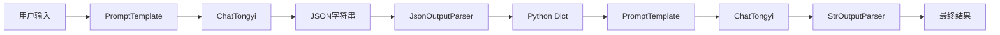

# LangChain 学习笔记：JsonOutputParser 基础使用

## 一、学习目标

- JsonOutputParser 的作用与使用方式
- 大模型结构化输出
- JSON 数据解析流程
- Prompt 与 JsonOutputParser 配合使用
- LCEL 链式调用中的数据传递

---

## 二、案例源码

```python
from langchain_core.output_parsers import StrOutputParser,JsonOutputParser
from langchain_community.chat_models.tongyi import ChatTongyi
from langchain_core.prompts import PromptTemplate

strParser = StrOutputParser()
jsonParser = JsonOutputParser()

model = ChatTongyi(model = "qwen-plus")

first_prompt = PromptTemplate.from_template(
"我邻居姓：{lastname}，刚生了{gender}，请帮忙起名字，并封装为JSON格式返回给我。要求key是name，value就是你起的名字，请严格遵守格式要求。"
)

second_prompt = PromptTemplate.from_template(
    "姓名{name}，请帮我解析含义"
)

chain = first_prompt | model | jsonParser | second_prompt | model | strParser
```

---

## 三、整体执行流程


---

## 四、JsonOutputParser 简介

JsonOutputParser 用于将大模型返回的 JSON 字符串自动解析成 Python 字典对象。

定义：

```python
jsonParser = JsonOutputParser()
```

作用：

```text
JSON字符串
      ↓
JsonOutputParser
      ↓
Python字典
```

例如：

模型返回

```json
{
    "name":"张诗涵"
}
```

解析后

```python
{
    "name":"张诗涵"
}
```

---

## 五、Prompt 设计

### 第一个 Prompt

```python
first_prompt = PromptTemplate.from_template(
"我邻居姓：{lastname}，刚生了{gender}，请帮忙起名字，并封装为JSON格式返回给我。要求key是name，value就是你起的名字，请严格遵守格式要求。"
)
```

输入：

```python
{
    "lastname":"张",
    "gender":"女儿"
}
```

生成提示词：

```text
我邻居姓：张，刚生了女儿，请帮忙起名字，并封装为JSON格式返回给我。
```

---

### 模型返回

```json
{
    "name":"张诗涵"
}
```

---

## 六、JsonOutputParser 工作过程

### 输入

```json
{
    "name":"张诗涵"
}
```

### 自动解析

```python
{
    "name":"张诗涵"
}
```

### 数据流

```text
JSON字符串
      ↓
JsonOutputParser
      ↓
Python Dict
```

---

## 七、第二个 Prompt

定义：

```python
second_prompt = PromptTemplate.from_template(
    "姓名{name}，请帮我解析含义"
)
```

接收数据：

```python
{
    "name":"张诗涵"
}
```

格式化后：

```text
姓名张诗涵，请帮我解析含义
```

---

## 八、LCEL 链式调用分析

```python
chain = (
    first_prompt
    | model
    | jsonParser
    | second_prompt
    | model
    | strParser
)
```

等价写法：

```python
step1 = first_prompt.invoke(data)

step2 = model.invoke(step1)

step3 = jsonParser.invoke(step2)

step4 = second_prompt.invoke(step3)

step5 = model.invoke(step4)

result = strParser.invoke(step5)
```

---

## 九、流式输出

```python
res = chain.stream(
    {
        "lastname":"张",
        "gender":"女儿"
    }
)
```

输出：

```python
for chunk in res:
    print(chunk,end="",flush=True)
```

示例结果：

```text
张诗涵：

诗：代表文学修养与气质。

涵：代表包容、涵养与智慧。
```

---

## 十、JsonOutputParser 常见应用场景

| 场景 | 示例 |
|--------|--------|
| 信息抽取 | 姓名、年龄、电话 |
| 分类任务 | 情感分类 |
| 实体识别 | 人名、地名 |
| Agent开发 | 工具参数解析 |
| RAG系统 | 检索结果结构化 |

示例：

```json
{
    "question":"什么是大模型",
    "category":"AI"
}
```

---

## 十一、JsonOutputParser 与 StrOutputParser 对比

| 对比项 | JsonOutputParser | StrOutputParser |
|----------|----------|----------|
| 返回类型 | Dict | String |
| 是否结构化 | 是 | 否 |
| 适合场景 | Agent、工作流 | 普通聊天 |
| 可直接取字段 | 支持 | 不支持 |

---

## 十二、核心知识总结

| 组件 | 作用 |
|--------|--------|
| PromptTemplate | 构建提示词 |
| ChatTongyi | 调用大模型 |
| JsonOutputParser | JSON解析 |
| StrOutputParser | 字符串解析 |
| Dict | 结构化数据 |
| invoke() | 同步执行 |
| stream() | 流式输出 |
| LCEL | 链式工作流 |

---

## 十三、学习结论

JsonOutputParser 是 LangChain 中实现结构化输出的核心组件。

典型工作流：

```text
Prompt
 ↓
LLM
 ↓
JsonOutputParser
 ↓
Dict
 ↓
Prompt
 ↓
LLM
 ↓
StrOutputParser
```

在实际项目中，JsonOutputParser 经常用于 Agent、RAG、工具调用和信息抽取等场景，可以让大模型输出的数据直接进入程序逻辑处理流程。
