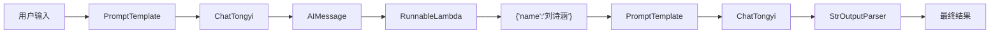

# LangChain 学习笔记：RunnableLambda 基础使用

## 一、学习目标

- RunnableLambda 的基本用法
- LangChain LCEL 链式调用
- Prompt 与大模型之间的数据传递
- 中间数据处理与转换
- 多 Prompt 串联工作流

---

## 二、RunnableLambda 简介

`RunnableLambda` 是 LangChain 中用于执行自定义 Python 函数的数据处理组件。

```python
RunnableLambda(lambda x: ...)
```

作用：

```text
输入
 ↓
RunnableLambda
 ↓
转换后输出
```

---

## 三、案例源码

```python
from langchain_core.output_parsers import StrOutputParser
from langchain_core.prompts import PromptTemplate
from langchain_community.chat_models.tongyi import ChatTongyi
from langchain_core.runnables import RunnableLambda

model = ChatTongyi(
    model='qwen-plus'
)

strParser = StrOutputParser()

first_prompt = PromptTemplate.from_template(
    '我邻居姓：{lastname}，刚生了{gender}，请帮忙起名字，只告诉我名字即可，不需要额外信息'
)

second_prompt = PromptTemplate.from_template(
    "姓名{name},请告诉我名字含义"
)

my_func = RunnableLambda(
    lambda ai_msg: {"name": ai_msg.content}
)

chain = first_prompt | model | my_func | second_prompt | model | strParser
```

---

## 四、整体执行流程



---

## 五、核心模块解析

### 1. ChatTongyi

负责调用通义千问模型。

```python
model = ChatTongyi(
    model="qwen-plus"
)
```

返回结果：

```python
AIMessage(
    content="刘诗涵"
)
```

### 2. PromptTemplate

构造动态提示词。

```python
first_prompt = PromptTemplate.from_template(
    '我邻居姓：{lastname}，刚生了{gender}，请帮忙起名字'
)
```

输入：

```python
{
    "lastname":"刘",
    "gender":"女儿"
}
```

生成：

```text
我邻居姓：刘，刚生了女儿，请帮忙起名字
```

### 3. RunnableLambda

定义：

```python
my_func = RunnableLambda(
    lambda ai_msg:{
        "name": ai_msg.content
    }
)
```

数据变化：

```text
AIMessage(content="刘诗涵")
            ↓
RunnableLambda
            ↓
{"name":"刘诗涵"}
```

等价写法：

```python
def my_function(ai_msg):
    return {
        "name": ai_msg.content
    }
```

### 4. StrOutputParser

将 AIMessage 转换为字符串。

```python
strParser = StrOutputParser()
```

---

## 六、LCEL 链式调用

```python
chain = (
    first_prompt
    | model
    | my_func
    | second_prompt
    | model
    | strParser
)
```

等价执行过程：

```python
step1 = first_prompt.invoke(data)
step2 = model.invoke(step1)
step3 = my_func.invoke(step2)
step4 = second_prompt.invoke(step3)
step5 = model.invoke(step4)
result = strParser.invoke(step5)
```

---

## 七、流式输出

```python
res = chain.stream(
    {
        "lastname":"刘",
        "gender":"女儿"
    }
)

for chunk in res:
    print(chunk,end="",flush=True)
```

效果：

```text
刘诗涵：

刘：姓氏
诗：文学修养
涵：包容与智慧
```

---

## 八、RunnableLambda 常见场景

| 场景 | 示例 |
|--------|--------|
| 字段提取 | `{"name":msg.content}` |
| 数据清洗 | `text.strip()` |
| 大小写转换 | `text.upper()` |
| 数据格式转换 | 添加时间戳 |
| 字段拼接 | 拼接多个参数 |

示例：

```python
RunnableLambda(
    lambda text:text.strip()
)
```

```python
RunnableLambda(
    lambda text:text.upper()
)
```

```python
RunnableLambda(
    lambda msg:{
        "title":msg.content,
        "time":datetime.now()
    }
)
```

---

## 九、知识点总结

| 组件 | 作用 |
|--------|--------|
| PromptTemplate | 构建提示词 |
| ChatTongyi | 调用大模型 |
| RunnableLambda | 数据转换 |
| AIMessage | 模型输出对象 |
| StrOutputParser | 输出解析 |
| LCEL | 链式调用语法 |
| invoke() | 同步执行 |
| stream() | 流式输出 |

---

## 十、学习总结

RunnableLambda 是 LangChain 工作流中的数据处理节点。

典型结构：

```text
Prompt
 ↓
LLM
 ↓
RunnableLambda
 ↓
Prompt
 ↓
LLM
 ↓
Parser
```

其核心作用是对模型输出进行加工、提取和转换，是构建复杂 AI Agent 与工作流的重要基础组件。
